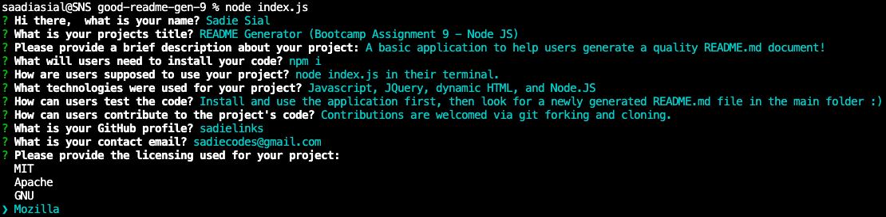

# README Generator (Bootcamp Assignment 9 - Node.JS)

By: Sadie Sial
___


## Table of Contents

* [Description](#description)
* [Installation](#installation)
* [Usage](#usage)
* [Technologies](#technologies)
* [Screenshots](#screenshots)
* [Links](#links)
* [Contact](#contact)
* [License](#license)
<br><br>

## Description <br>

This is a command-line application that takes the users input and generates a quality README.md document. Users will be walked through the installation process and then guided on how to continue throught their command-line in order to create their new README based off of their selected inputs.

### User Story:

```
AS A developer
I WANT a README generator
SO THAT I can quickly create a professional README for a new project
```

```
GIVEN a command-line application that accepts user input
WHEN YOU are prompted for information about your application repository
THEN a high-quality, professional README.md is generated with the title of your project and sections entitled Description, Table of Contents, Installation, Usage, Technologies, Tests, Contributing, Questions, and License
WHEN YOU enter your project title
THEN this is displayed as the title of the README
WHEN YOU enter a description, installation instructions, usage information, technologies used, test instructions, and contribution guidelines
THEN this information is added to the sections of the README entitled Description, Table of Contents, Installation, Usage, Technologies, Tests, and Contributing
WHEN YOU choose a license for your application from a list of options
THEN a badge for that license is added near the top of the README and a notice is added to the section of the README entitled License that explains which license the application is covered under
WHEN YOU enter your GitHub username
THEN this is added to the section of the README entitled Questions, with a link to your GitHub profile
WHEN YOU enter your email address
THEN this is added to the section of the README entitled Questions, with instructions on how to reach me with additional questions
WHEN YOU click on the links in the Table of Contents
THEN YOU are taken to the corresponding section of the README
```

## Installation

Users will need to install the following in their command line:
```
npm i
```


## Usage

After the installation process, users will then need to run the following in their command line:
```
node index.js
```
This will start the generator process for the users. Once they have answered the prompts to the best of their ability, a new file called, `GenREADME.md` will be created in the main folder. They are encouraged to further add to their README's to dress things up as much as the would like!
<br><br>


## Technologies

The technologies used to create this program were: 
- Javascript
- Node.JS
<br><br>

## Screenshots
```
Command Line question/answer:
```


```
Finished responses displayed in console:
```


```
Generated README.md preview:
```


```
Walkthrough video:
```
https://user-images.githubusercontent.com/87392794/134828727-ea31263e-89fa-49db-bdaf-ec19ebd101dc.mov


<br>

## Links

- [External Video Link](https://watch.screencastify.com/v/2nPAK0kNzjQqtOpGmB7c)

- [GitHub Repository](https://github.com/sadielinks/the-readme-gen)

<br>

## Contact

- [GitHub Profile](https://github.com/sadielinks)
- [Portfolio](https://sadielinks.github.io/professional-portfolio/)
- [Email](mailto:sadiecodes@gmail.com)

<br>

## License

This source code is available to everyone under the standard [MIT license ©](https://choosealicense.com/licenses/mit/) <br><br>
© 2021 Trilogy Education Services, LLC, a 2U, Inc. brand. Confidential and Proprietary. All Rights Reserved.
